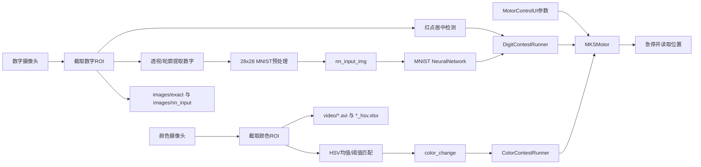
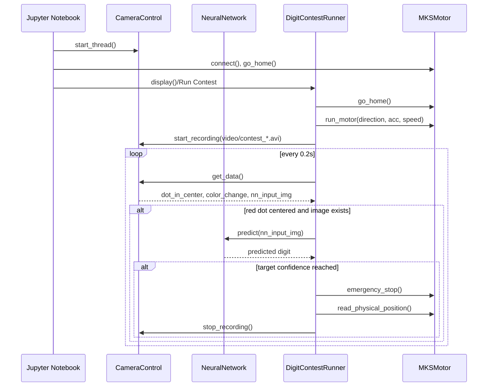
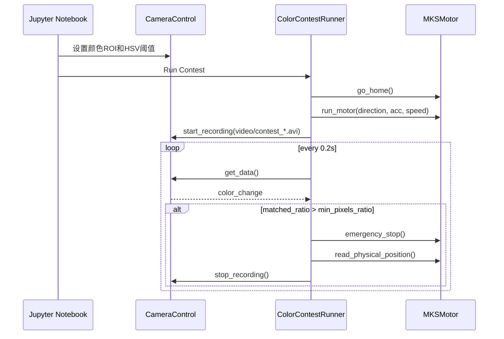

## 目录

```text
Medical_ML_Class/
├── experiment/
│   ├── camera_control.py              # 双摄像头采集、数字图像处理、颜色变化检测、录像与HSV日志
│   ├── MKSMotor_USB.py                # MKS步进电机Modbus串口驱动和Jupyter控制面板
│   ├── contest_helper_code.py         # 竞赛流程封装：数字识别停车、颜色变化停车
│   ├── model.py / model_only.py       # 从零实现的MNIST数字分类神经网络
│   ├── extract_drive_start.py         # 离线读取HSV日志并分析触发阈值
│   ├── *.ipynb                        # 实验采集、颜色分析、竞赛Notebook
│   ├── images/                        # 数字识别训练/采样数据、提取图像、NN输入文本
│   ├── video/                         # 实验录像、HSV日志、标定Excel
│   ├── 比赛日标定数据/                # 比赛日颜色/时间标定数据
│   └── 说明书与驱动/                  # MKS电机说明书与CH340/CH341驱动
│
├── homework/
│   ├── Class1-2_HW/                   
│   ├── Class3-5_HW/                   
│   └── Class4-6_HW/
│
└── 《医药人工智能》2025-2026回忆卷.pdf
```

### 一些报告说明
```text
  笔者写得有些痛苦。建议是善用AI。然后可能需要区分一下.py和.ipynb文件的区别以免代码打不开（。笔者报告写的比较放飞自我，对一些超参数也没有进行优化，如果没有更改作业题目的话可以进行一些参考吧。作业所给的题目在index.html中用英文给出，笔者做的时候是将该index.html扔入AI中让其在不更改格式的前提下翻译为中文得到index_cn.html，需要注意的是要将得到的index_cn.html复制到与index.html相同的目录下再打开。
  手写数字数据集为mnist数据集，由于传输文件限制，需要网络搜索下载得到。
```

### 一些实验说明
```text
  因为笔者所在的小组在实验的前两节课被数字识别的摄像机折磨，故花了精力改了所给的代码用以寻找问题与解决问题（PS:最后用螺丝刀解决，大家如果碰到识别不出数字可以先观察一下是否是因为没对焦，如果是可以找老师用螺丝刀解决）。对颜色识别的分析比较少。就最后结果来说笔者做的颜色识别比较差（笔者拟合出来大概为0.7次方，比不过他们用线性拟合的效果）
  另外，笔者觉得实验基本不依赖代码水平或程序优化。笔者所在的小组2mm的误差喜提8个小组的倒数第二（还是倒数第三来着），这个误差到了人为操作误差不可忽视的程度。不知道后面会在实验流程和评判标准上是否有所修改。
```

### 一些报告展示说明
```text
  笔者这一届的报告展示要求是寻找一种在开发流程中运用了人工智能的药物，但笔者觉得按李老师后面的意思也可以做文献调研，找到一篇/几篇文献（他说可以去相关综述里面找药物）。药物的选择遵循先到先得原则，展示顺序依照花名册顺序从前到后，时间要求在十分钟左右，一节课会安排四名同学展示，对PPT的质量要求不高，对时间的把控比较严格。每名同学的展示结束后会有提问环节（有且一个问题），笔者推荐是打假赛（即提前安排同学问你指定的问题），对提问的同学说是有加分，若没有提问的同学他将自己提问，难度不高且较开放（笔者印象李没有问过具体细节问题，只会大概泛泛询问，如"就基于你所介绍的药物开发流程，你觉得药物开发花费最大的环节是什么"这样的问题）
```

### 一些考试说明
```text
  笔者觉得有些恶心。莫老师所讲的部分一般仅涉及到梯度下降和贝叶斯优化，梯度下降连出了两年大题，贝叶斯优化仅出现在选择判断中。第三次作业涉及的大模型和智能体笔者印象里并没有为难大家。李老师所讲部分包含了最后两道共50分的论述题和前面一道15分的简答题，以及一部分选择题、判断题。选择题和判断题出的很刁钻（没有回忆卷笔者做梦也不会去记活性多肽数据库），但回忆卷能覆盖到蛮大一部分的（笔者实在记不下来全部，只能尽力回忆和上一年相似的部分了）。简答和论述比较恶心的是包含了他所讲的所有部分，没有所谓重点与非重点之分，甚至在笔者所做的回忆卷中要求记具体的事例（PS:在多肽的有关事例里，笔者写了李老师当时的工作环肽合成判断机器人，笔者还蛮期待他的反应的），而且导论出一道25分值的大题也太阴间了吧，简答和去年一样固体多肽合成，因为有回忆卷笔者是写了，但就知识点来说也是蛮不友好的。
```

## `experiment` 说明

### 模块职责

| 模块 | 主要职责 | 关键类/函数 | 主要输入 | 主要输出 |
|---|---|---|---|---|
| `camera_control.py` | 打开双摄像头、截取ROI、检测红点、提取数字、预处理为MNIST输入、检测颜色变化、录像和HSV日志 | `CameraControl`, `process_digit_img`, `process_color_img`, `preprocess_to_MNIST`, `extract_number_img` | 摄像头帧、ROI参数、HSV阈值 | `dot_in_center`, `color_change`, `nn_input_img`, `.avi`, `_hsv.xlsx`, 提取图片 |
| `MKSMotor_USB.py` | 通过Modbus RTU控制MKS电机，提供Jupyter UI | `MKSMotor`, `MotorControlUI` | 串口、方向、加速度、速度 | 电机运动、急停、回零、物理位置mm |
| `contest_helper_code.py` | 将摄像头、电机和模型串成竞赛流程 | `preflight_check`, `DigitContestRunner`, `ColorContestRunner` | `CameraControl`, `MKSMotor`, `MotorControlUI`, MNIST模型 | 达到目标后停车、停止时间、停止位置 |
| `model.py` / `model_only.py` | 从零实现全连接神经网络，训练/加载MNIST数字分类器 | `NeuralNetwork`, `load_data`, `train_test_split` | CSV图像数据 | `model.pkl` / `model_only_right.pkl`, 数字预测 |
| `extract_drive_start.py` | 离线分析HSV日志中何时达到颜色阈值 | `analyze_color_change`, `check_color_threshold` | Excel HSV日志 | 阈值触发事件 |

### 实验运行工作流



### 数字识别竞赛流程



### 颜色变化竞赛流程




